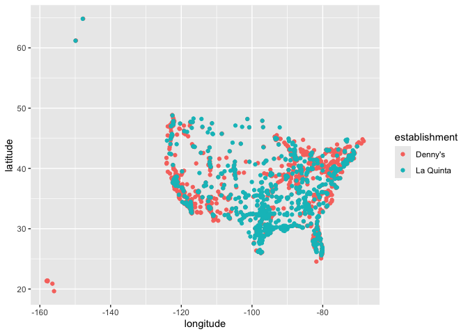
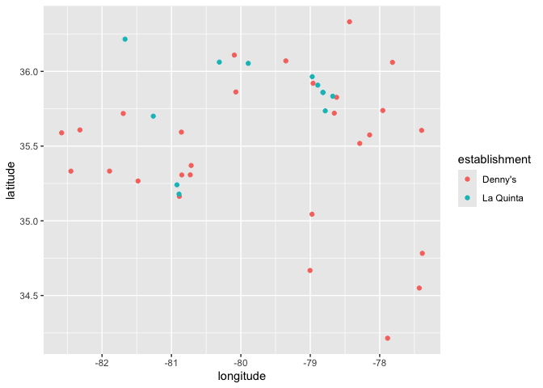
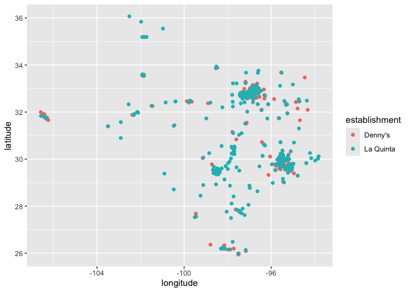

Lab 04 - La Quinta is Spanish for next to Denny’s, Pt. 1
================
Cailey Fay
10.13.25

### Load packages and data

``` r
library(tidyverse) 
library(dsbox) 
```

``` r
states <- read_csv("data/states.csv")
```

### Exercise 1

``` r
?dennys
nrow(dennys)
```

    ## [1] 1643

``` r
ncol(dennys)
```

    ## [1] 6

``` r
#Each row represents a dennys location. The variables are the address, city, state, zip, longitude and lattitude. 
```

### Exercise 2

``` r
nrow(laquinta)
```

    ## [1] 909

``` r
ncol(laquinta)
```

    ## [1] 6

``` r
??laquinta
#Its 909 x 6. The rows represent the motel, and the variables are the address, city, state, zip, longitude, and lattitude. 
```

… \### Exercise 3

``` r
#there are dennys outside of the US - canada, puerto rico, UK. Same thing with laquinta - they are in canada, mexico, turkey, etc. 
```

### Exercise 4

``` r
#I would look at longitude and latitude and do a filter so that we isolate to just the rectangle encompassing all of the US minus Hawaii and Alaska and then I'd probably manually add in the alaska / hawaii because how many could there really be? 
```

…

### Exercise 5

``` r
#whats the deal with dn? ??dn reveals nothing
library(dsbox)
data()
#I don't see dn anywhere - is it possible that I am using a different version of dsbox that calls dn something else? 
dennys %>%
  filter(!(state %in% states$abbreviation))
```

    ## # A tibble: 0 × 6
    ## # ℹ 6 variables: address <chr>, city <chr>, state <chr>, zip <chr>,
    ## #   longitude <dbl>, latitude <dbl>

``` r
#it looks like there are no dennys outside of the US in the data file? Since when I do this, I have rows of data:
```

…

### Exercise 6

``` r
dn <- dennys %>%
    mutate(country="United States")
```

… \### Exercise 7

``` r
internationallaquinta <- laquinta %>%
  filter(!(state %in% states$abbreviation))
#there are 14 laquintas outside of the US 
#they belong to the following countries: Mexico x 10, colombia, Canada x2, Honduras. Abbreviations are AG, QR, CH, NL, ANT, ON, VE, PU, SL, FM, and BC.  
```

… \### Exercise 8

``` r
newlaquinta <- laquinta %>%
  mutate(country = case_when(
  state %in% state.abb ~ "United States",
  state %in% c("ON", "BC") ~ "Canada",
  state == "ANT" ~ "Colombia",
  state %in% c("AG", "QR", "CH", "NL", "PU","SL", "FM") ~ "Mexico",
  state == "FM"~"Honduras"
  ))
  
lq <- newlaquinta %>%
  filter(country == "United States")
```

… \### Exercise 9

``` r
dn %>%
  count(state) %>%
  inner_join(states, by = c("state" = "abbreviation"))
```

    ## # A tibble: 51 × 4
    ##    state     n name                     area
    ##    <chr> <int> <chr>                   <dbl>
    ##  1 AK        3 Alaska               665384. 
    ##  2 AL        7 Alabama               52420. 
    ##  3 AR        9 Arkansas              53179. 
    ##  4 AZ       83 Arizona              113990. 
    ##  5 CA      403 California           163695. 
    ##  6 CO       29 Colorado             104094. 
    ##  7 CT       12 Connecticut            5543. 
    ##  8 DC        2 District of Columbia     68.3
    ##  9 DE        1 Delaware               2489. 
    ## 10 FL      140 Florida               65758. 
    ## # ℹ 41 more rows

…

\###Exercise 10

``` r
dn <- dn %>%
  mutate(establishment = "Denny's")
lq <- lq %>%
  mutate(establishment = "La Quinta")
dn_lq <- bind_rows(dn, lq)
# made the new combined variable successfully 
ggplot(dn_lq, mapping = aes(
  x = longitude,
  y = latitude,
  color = establishment
)) +
  geom_point()
```

<!-- -->

\###Exercise 11

``` r
NConly <- dn_lq %>%
  filter(state == "NC")
ggplot(NConly, mapping = aes(
  x = longitude,
  y = latitude,
  color = establishment
)) +
  geom_point()
```

<!-- -->

\###Exercise 12

``` r
TXonly <- dn_lq %>%
  filter(state == "TX")
ggplot(TXonly, mapping = aes(
  x = longitude,
  y = latitude,
  color = establishment
)) +
  geom_point()
```

<!-- -->

``` r
#The joke most certainly holds for texas, but only sort of for NC 
```
